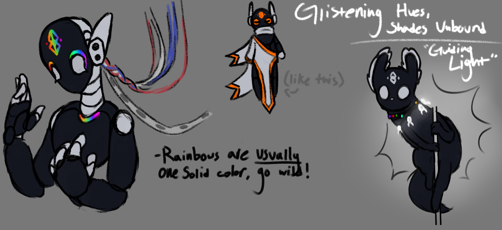
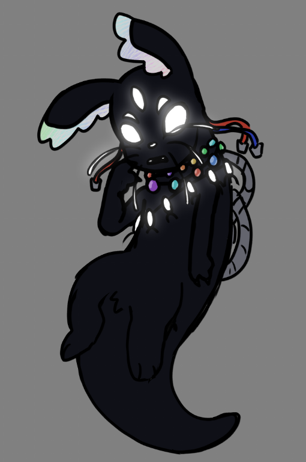

## A hyperintelligent slugcat with the ability to commune with Neuron Flies, and seemingly read and write data to pearls using nothing but its own two hands.

The Guiding Light is a **!!work in progress!!** slugcat mod for Rain World. Currently, there is nothing planned for a campaign besides a base backstory, but I wanted to make a sort of proof-of-concept anyways.

# Lore
Monochromatic Rainbows was a shoddily made iterator towards the end of the Ancient's time (and nearby to the local group that base game + Downpour scugs take place in). Due to poor build quality and lack of maintenance, MR found themself falling apart from the bottom up. With each cycle, their structure became less and less stable. In desperation, they contacted NSH, who contacted SRS, who gave them the blueprints for their own personal messenger. However, MR's plans were a bit different.   MR fabricated a vessel, and injected bio-mechanical genes into their DNA, causing them to take on the features of a neuron fly, and the ability to interface with other neuron flies. Then, as it developed, slowly, but surely, MR transferred their vital knowlege into just a few pearls, using a highly condensed, yet fragile engraving method. They then linked a few neuron flies to their vessel, and effectively deactivated themself in favor of their new vessel, The Guiding Light.   They now roam this drowned earth, with the objective of helping those who need it...

# Gallery

